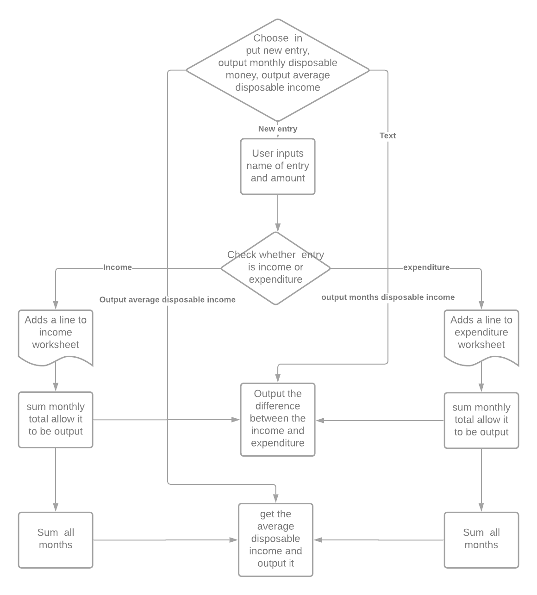

# Disposable income calculator

## Contents

* [Contents](#contents)
* [Top](#Disposable-Income)
* [Description](#description)
* [Logic](#Logic-diagram)
* [Features](#features)
* [Game Play](#game-play)
* [Testing](#testing)
* [Technologies](#technologies)
* [Deployment](#deployment)
* [Future Additions](#future-additions)

## Disposable Income

## Description

This app is designed to allow somebody to track their disposable income by allowing them to add money they have gained or spent. They will be able to see how much money they have left in total, for that month or on average. 
The app is deployed through heroku and requires very limited input to use. The app updates two sheets in a Googlesheet's worksheet and allows the data to be returned from there.

## Logic diagram

* Two functions were added after the program was passed the planning stage please see  features section for details.

## Features

The app has 7 feature:-
1. Input a new income, this will find todays date taking the month and year storing as a tuple, the user then inputs a name for the entry and a corresponding amount. These then get added to the spread sheet in a new row.
2. Input a new expense, this will find todays date taking the month and year storing as a tuple, the user then inputs a name for the entry and a corresponding amount. These then get added to the spread sheet in a new row.
3. The user is able to return the total for the income minus the total for the expense.
4. The user is able to return the total for the income for the current month minus the total for the expense for the current month
5. The user is able to return the total amount from option 3 divided by the average different amount of month held within the spread sheet. this is checked by comparing the two different sheets to see which has more months
6. The user is able to return the last 5 entries in the income spread sheet by pressing 6
7. The user is able to return the last 5 entries in the expense spread sheet by pressing 7

There are validators to check firstly that the user only enter a number between 1 and 5 and that when the user enters an amount they enter either an int or a float.
The last two features were added once all the program had been built as an after though and so will not appear on the logic flow chart.

## How to Use the app

1. When the app finishes loading read the instructions the first part is the most important as it tells you to ensure you are clicked inside the terminal
2. Then follow the instructions as they are on screen
3. if you need to start again simply click on the run app button at the top

## Testing

How I have tested the code:
* The python code has been run through the [Python pep8 validator](http://pep8online.com/)
* I have also rigorously run the code through many cycles adding in different values and checking that the output is as expected, in order to do this i:
    * ran the code selected 1, pressed enter. entered a name pressed enter and checked the income spreadsheet to check it was updated correctly
    * ran the code selected 2, pressed enter. entered a name pressed enter and checked the expense spreadsheet to check it was updated correctly
    * ran the code selected 3, pressed enter. entered a name pressed enter, read the output and compared to the expected figure after deducting the total expense amount from the total income
    * ran the code selected 4, pressed enter. entered a name pressed enter, read the output and compared to the expected figure after deducting the total expense amount from the total income for the current month only
    * ran the code selected 5, pressed enter. entered a name pressed enter, read the output and compared to the expected figure after taking the figure from step 3 and then dividing by how many different months there are 

### Bugs

#### Existing Bugs

#### Solved bugs

* Initially the code was needing to be ran each time and not looping back - this was solved by calling the main() function each time the last run had finished
* There were several instances where my code was not working and this was caused by type errors these were resolved by ensuring each bit of data were the exact same type.

## Technologies

* [Python](https://en.wikipedia.org/wiki/Python_(programming_language))
* [Heroku](https://en.wikipedia.org/wiki/Heroku)

## Deployment

1. Ensure all the dependencies are included by adding them to the requirements.txt file by running the following command in the terminal: pip3 freeze > requirements.tx
2. Ensure the project has been fully committed and pushed to git 
3. Go to your heroku account, if you don't have one create one
4. On the home screen click on the create new app button
5. Enter a name for the project and select your region to the correct region.
6. On the next screen select settings
7. Go to config vars and click reveal config vars
8. Switch to the program file and where you are keeping your credentials copy these and then on heroku enter a name for the key and paste the code into the config vars value box and click add
9. Now scroll down to buildPacks and click add build packs
10. First select python and click save changes
11. Click back into build packs and choose node.js and click save again
12. Ensure that the Python  build pack is at the top of the list you are abe to drag and drop if you need to rearrange
13. Now select deploy
14. From the deployment method select GitHub
15. Then click on the connect to github button that appears
16. Click into the search box and search for the project name
16. Once located select connect
17. Then click deploy branch, this will then be shown in the box below
18. You can the click view to show the app in a browser

The program can be deployed automatically but i have chosen to keep it as a manual deploy so i can ensure that while i am testing and have no intention of adding more to the code currently it is better to deploy it manually meaning returning to the screen and clicking deploy branch each time you want to make any changes.

### Cloning

How to clone this repository. [How to clone a github repository](https://docs.github.com/en/github/creating-cloning-and-archiving-repositories/cloning-a-repository-from-github/cloning-a-repository)

* On GitHub go to the main page of the Repository.
* Above the list of files click the code button with the drop-down arrow.
* To clone the repository using HTTPS, under "Clone with HTTPS", click on the clipboard.
* Open the Git Bash terminal.
* Change the current working directory to the location where you want the cloned directory.
* Type git clone, and then paste the URL you copied earlier from step 3.
* Press Enter to create your local clone.

## Future Additions

There is plenty of room for additional functions that can be added later such as:
* Displaying all items that have been paid for this month or allowing the user to choose an alternative month to display different data.
* This could also be put into nicer front end using HTML CSS and JS in order to get the data in such a way that would give a better UX and UI.
* I also plan on enabling the app to create new worksheets for different users and enabling the user to enter their user name in order to get each persons personal data out, at the moment this is a standalone (one user) app.

## Citations

* I required to limit my out put to a float with 2 decimal place on one of the functions and used [This link](https://stackoverflow.com/questions/20457038/how-to-round-to-2-decimals-with-python) to a stack overflow article
* I had trouble getting my while loop to work so i checked on [W3Schools](https://www.w3schools.com/python/python_while_loops.asp)
* I used the multiline on strings my decide_function() as i believed this would make the code dry. I found the best way to do this from [W3Schools Python Multi Line Strings](https://www.w3schools.com/python/gloss_python_multi_line_strings.asp)
* I required to know how to get the last entry from a list [How to obtain the last index of a list?](https://stackoverflow.com/questions/7889820/how-to-obtain-the-last-index-of-a-list)